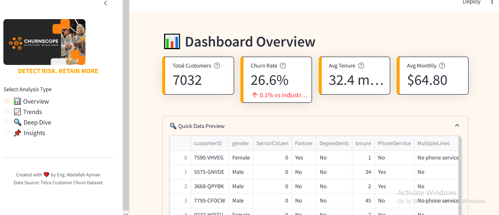
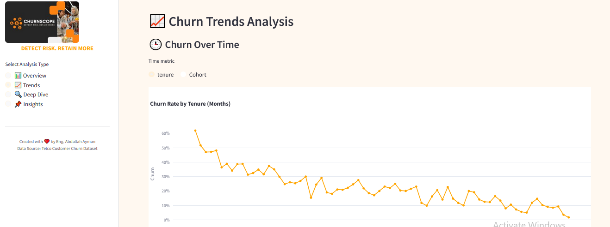
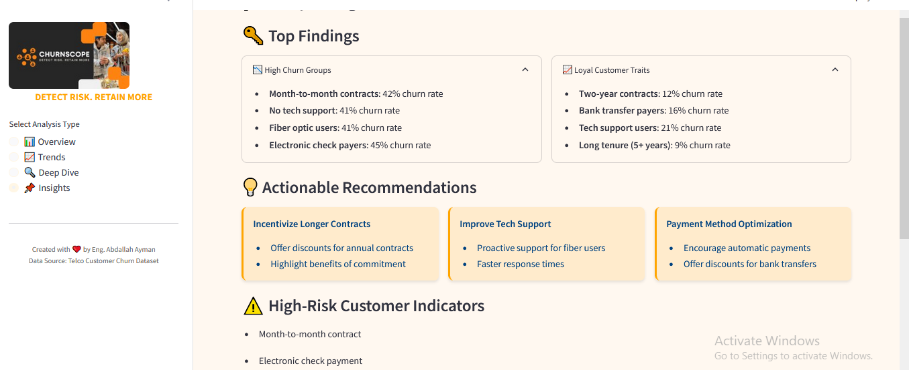

# DEPI-Graduation-Project
# CHURNSCOPE Dashboard





Professional Customer Churn Analysis Dashboard with Orange/Black Theme

## Features

- 📊 Interactive customer churn analysis
- 📈 Trend visualization
- 🔍 Deep dive analytics
- 📌 Actionable insights
- 🎨 Modern orange/black theme

## Installation

1. Clone the repository:
```bash
git clone [https://github.com/your-username/churnscope-dashboard.git](https://github.com/Bodaxxt/DEPI-Graduation-Project.git)

#install requirements

pip install -r requirements.txt
#run dashboard

streamlit run churnscope_dashboard.py

customer Attrition Prediction and Analysis
#Team Members
Mohamed Osama Ali
abdallah ayman mohamed 
Yassin ahmad hassan
Seif Ashraf fouzy roushdy
Mohamed Hassan Fatthalla 


